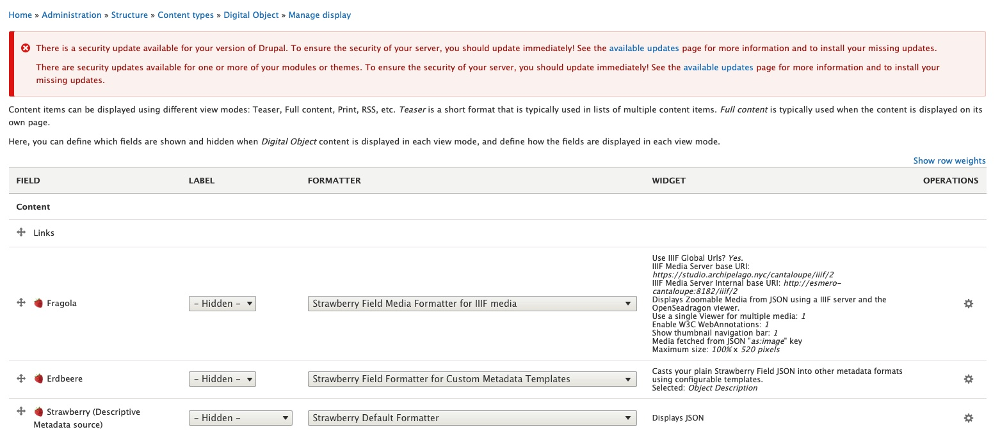
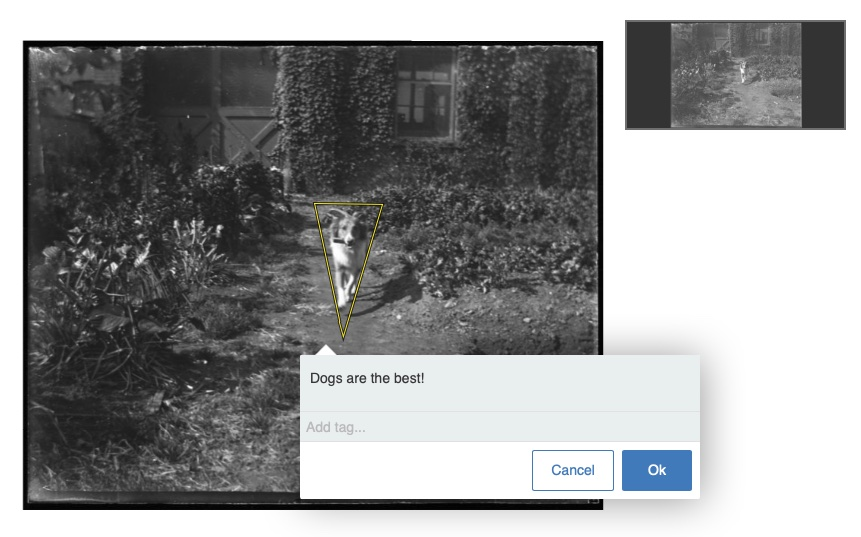
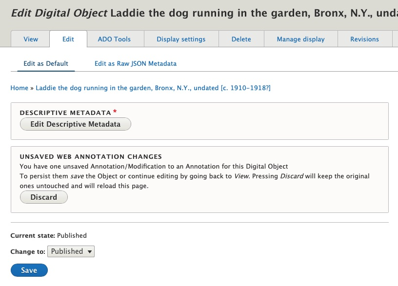
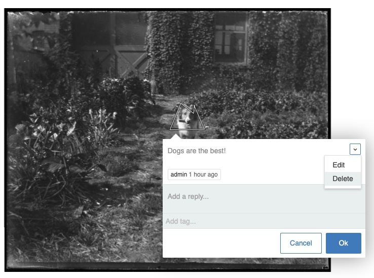

# Annotations in Archipelago

Archipelago extends [Annotorius](https://github.com/recogito/annotorious) to provide W3C-compliant Web Annotations for Digital Objects. These annotations can be added per image (when multiple), edited for text and shape adjustments, and saved/discarded using the regular Edit mode (bonus track 1: temp storage that persists when you log out and come back in to your session). Archipelago also exposes a full API for WebAnnotations, that keeps track of which Images (referenced in the [Strawberryfield](../docs/strawberryfields.md) @ `as:image`) were annotated and creates the W3C valid entries inside your Digital Object's JSON @ `ap:annotationCollection` (bonus track 2: multiple users can annotate the same resource, enabling digital scholarship collaboration opprotunities). 

_Important Note: For any image-based Digital Objects you would like to apply annotations to, the Digital Object `type` must be setup to display the image file(s) using the Open SeaDragon viewer. More information about about Managing Display Modes in Archipelago can be found [here](../docs/webformsasinput.md#manage-display). Please stay tuned for updates announcing web annotation integration for Mirador 3._

### Enabling Annotations
1. Navigate to Admin --> Structure --> Content types --> Digital Object --> Manage Display and select the "Digital Object Full view" mode. `https://yoursite.org/admin/structure/types/manage/digital_object/display/digital_object_viewmode_fullitem`
	
2. On the **“Fragola”** row, click on the small gear icon on the far right, which will be open the configurations for this display type. 
3. Select the **“Enable loading/editing of W3C webAnnotations”** option. 	
	
   - _Learn more about the JSON format of WebAnnotations here: https://www.w3.org/TR/annotation-model/#index-of-json-keys._
3. Under **"What tool to enable"**, select either the Rectangular or Polygon (freehand drawing) tool for your annotation style.
4. Select the 'Update' button.
5. Also **Save** your settings using the button at the bottom of the page.

:tada: You are now ready to get started adding annotations! :tada:

### Adding and Saving Annotations
1. Navigate to the image-based Digital Object you would like to apply annotations to.
2. To add a new annotation, select and hold the `Shift` key. Click and then drag to apply either a Rectangular box or multi-point Polygon shape.
3. Double click to exit the annotation drawing mode.
4. Enter the text for your annotation in the pop-up window.
	
5. Click the "Ok" button when you are ready.
6. To save your annotation (or annotations if you created multiple), navigate to the main Digital Object "Edit" tab, where you will see a message about Unsaved Web Annotation Changes.
	
7. Select "Save" to preserve your Annotation(s). They will now become part of your Digital Object's JSON, found under the `ap:annotationCollection` key.
	- _Pressing the "Discard" button will discard only the unsaved Annotations, and will reload the page._

### Editing and Deleting Annotations
1. Navigate to the image-based Digital Object you would whose annotation(s) you want to edit or delete.
2. Click within the Annotation and select the downwards arrow in the upper right-hand corner of the pop-up window.
3. Select either the "Edit" option and Edit the Annotation as desired; Or select the "Delete" option.
	
4. To preserve your editing or deleting actions, navigate to the main Digital Object "Edit" tab, where you will see a message about Unsaved Web Annotation Changes. _(See screenshot in Step 6 of [Adding and saving Annotations](https://github.com/esmero/archipelago-documentation/blob/1.0.0-RC3/docs/annotations.md#adding-and-saving-annotations) above.)_
5. Select "Save" to preserve your Annotation(s) edits or deletions. Pressing the "Discard" button will discard only the unsaved Annotations changes, and will reload the page.
	
---

Thank you for reading! Please contact us on our [Archipelago Commons Google Group](https://groups.google.com/forum/#!forum/archipelago-commons) with any questions or feedback.

Return to the [Archipelago Documentation main page](../README.md).
