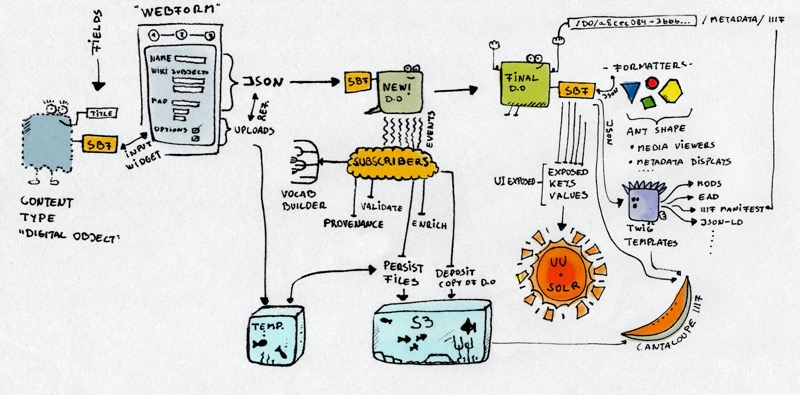

# Archipelago's File Persistence Strategy

### How are files for Archipelago Digital Objects (ADOs) persisted? (What happens with those fishtanks?)

A few Event Subscribers/Data describing logics happen in a certain order:

1. User Uploads via a webform Element a new File or via Drush/Batch ingest that attaches (via JSONAPI) a file.

2. If the webform is involved, Archipelago acts quickly and calls directly (before the Node even exists) the file classifier, that will:
    2.1. Add/complement a `as:somefiletype` JSON structure into the main `ADO` SBF `JSON`, with info about the file, checksums, size, Drupal fids, uuid, etc. This is a [heavy function](https://github.com/esmero/strawberryfield/blob/1.0.0-RC3/src/StrawberryfieldFilePersisterService.php) part of the `StrawberryfieldFilePersisterService`. It does a lot, making use of optimized logic, but may do more in the future to handle too-many/too-big files needs (FYI: solution will be simple, add to a queue and process later).
    2.2. The most (yes) important info added here is the [desired](https://github.com/esmero/strawberryfield/blob/1.0.0-RC3/src/StrawberryfieldFilePersisterService.php) future storage location of the file.

3. The user finishes the form, saves and and confirms the ADO creation, and finally all the Node events fire.

4. On presave `StrawberryfieldEventPresaveSubscriberAsFileStructureGenerator` runs and checks if 2.1 already was processed. This is needed since the user could have triggered an ingest via drush/JSONAPI/Webhooks etc. If all is well (this is a less expensive check) Archipelago continues.

5. On presave (next) `StrawberryfieldEventPresaveSubscriberFilePersister` runs, checking all TEMPORARY files described in `as:somefiletype` and actually copying them to the right "desired" location.

6. And on Save `StrawberryfieldEventInsertFileUsageUpdater` also marking the file as "being" used by a Strawberry driven Node (different Event).

_Note: Anytime we remove directly from the raw JSON a full `as:somefiletype` structure of a sub-element from an `as:structure` we force Archipelago to do all the above again, and Archipelago can regenerate technical metadata. This has been used when updating EXIF binaries or even when something went wrong (while testing, but this stuff is safe no worries). Eventually, there will be a BIG red button that does that if you do not like JSON editing._

Discussions related to Archipelago's file persistence strategy and planned potential strategies can be be found here: [Strawberryfield Issues: 107](https://github.com/esmero/strawberryfield/issues/107), and here: [Strawberryfield Issues: 76](https://github.com/esmero/strawberryfield/issues/76). This page will be updated with additional information following future developments.

___

Thank you for reading! Please contact us on our [Archipelago Commons Google Group](https://groups.google.com/forum/#!forum/archipelago-commons) with any questions or feedback.

Return to the [Archipelago Documentation main page](index.md).
