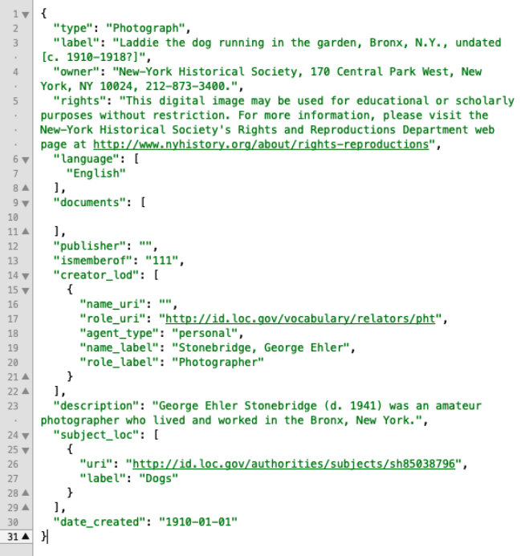
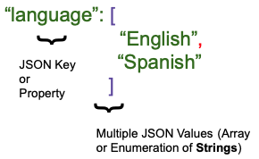

# Working with Twig in Archipelago

The following information can also be found in this Presentation from the "Twig Templates and Archipelago" Spring 2021 Workshop:
- [Twig Templates and Archipelago](https://docs.google.com/presentation/d/1qgYYESR1eMWuPXkpFwLnFiWXVZAf9Lhhaafq6Z3E138/edit?usp=sharing)

### Prequisites (with food analogy)

1. Know your Data/Metadata. What do i have?
	- What do i have in my Fridge? Do i have Tofu? Do i have Peppermint? One Bunch?
2. Know your final desired output Document: MODS, HTML, GEOJSON, etc. 
	- What are you going to cook? Do you have a picture of the Curry? Have you ever had Curry?
3. Know your Twig Basics
	- How to cut and dice, steam and sauté
4. Do not be afraid
	- You can’t get burned here and Ingredients do not expire!

##### Note about the Examples:
_All examples shown below are using the following JSON snipped from [Laddie the dog running in the garden, Bronx, N.Y., undated [c. 1910-1918?]](https://archipelago.nyc/do/17355bdb-d784-4037-96fe-5c160296e639)._

<details><summary>Click to view image of the JSON snippet.</summary>
  <span>



</span>
</details> 

<details><summary>Click to view this snippet as JSON.</summary>
  <span>

```json
{
    "type": "Photograph",
    "label": "Laddie the dog running in the garden, Bronx, N.Y., undated [c. 1910-1918?]",
    "owner": "New-York Historical Society, 170 Central Park West, New York, NY 10024, 212-873-3400.",
    "rights": "This digital image may be used for educational or scholarly purposes without restriction. Commercial and other uses of the item are prohibited without prior written permission from the New-York Historical Society. For more information, please visit the New-York Historical Society's Rights and Reproductions Department web page at http:\/\/www.nyhistory.org\/about\/rights-reproductions",
    "language": [
        "English"
    ],
    "documents": [],
    "publisher": "",
    "ismemberof": "111",
    "creator_lod": [
        {
            "name_uri": "",
            "role_uri": "http:\/\/id.loc.gov\/vocabulary\/relators\/pht",
            "agent_type": "personal",
            "name_label": "Stonebridge, George Ehler",
            "role_label": "Photographer"
        }
    ],
    "description": "George Ehler Stonebridge (d. 1941) was an amateur photographer who lived and worked in the Bronx, New York.",
    "subject_loc": [
        {
            "uri": "http:\/\/id.loc.gov\/authorities\/subjects\/sh85038796",
            "label": "Dogs"
        }
    ],
    "date_created": "1910-01-01"
}
```

</span>
</details>  	

### First: Know Your Data
Understanding the basic structure of your JSON data. 

1. Single JSON Value.

	- For `"type": "Photograph"`
		- "type" = JSON Key or Property
		- "Photograph" = Single JSON Value (string)

2.	Multiple JSON Values (Array of Enumeration of **Strings**)

	- For `"language": ["English","Spanish"]`
		- "language" = JSON Key or Property
		- "["English","Spanish"]" = Multiple JSON Values (Array of Enumeration of **Strings**)

3. Multiple JSON Values	(Array of Enumeration of **Objects**)

	- For `"subject_loc":[{"uri":"http://..","label":"Dogs"},{"uri":"http://..","label":"Pets"}]`
		- "subject_loc" = JSON Key or Property
		- [{"uri":"http://..","label":"Dogs"},{"uri":"http://..","label":"Pets"}] =
			- **Object** with two JSON Keys. Each one with a single Value
			- Multiple JSON Values (Array of Enumeration of **Objects**)

### Getting Started with the Twig Language in Archipelago
---

Thank you for reading! Please contact us on our [Archipelago Commons Google Group](https://groups.google.com/forum/#!forum/archipelago-commons) with any questions or feedback.

Return to the [Archipelago Documentation main page](../README.md).


